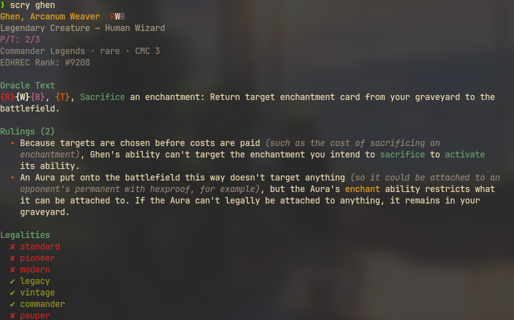
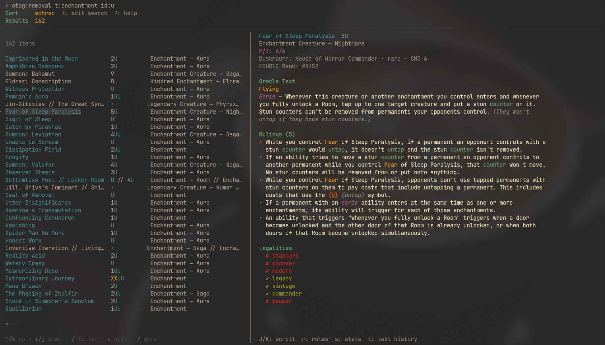
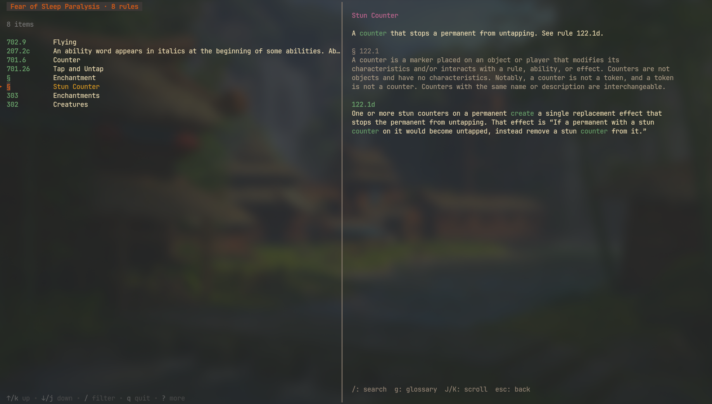
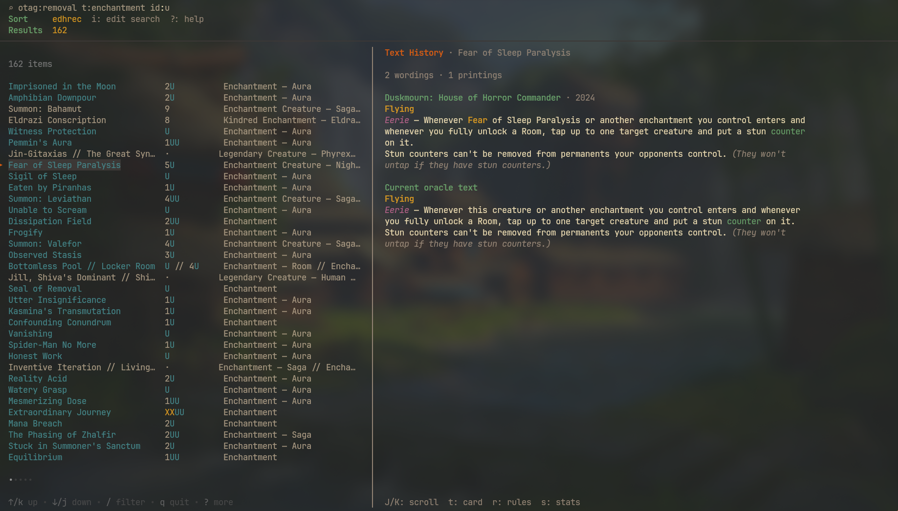
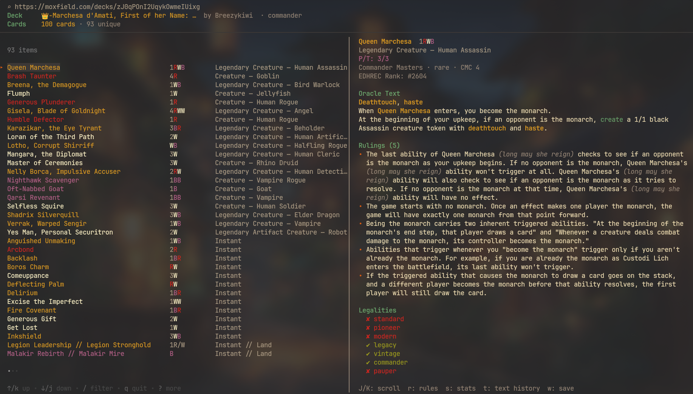
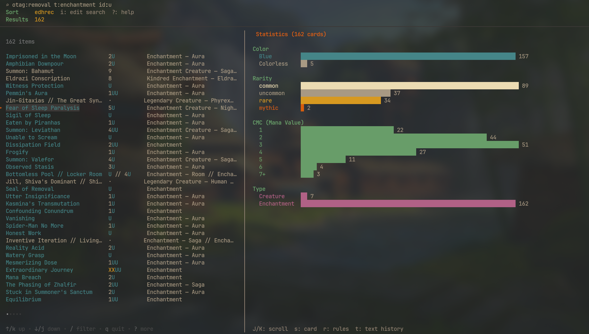
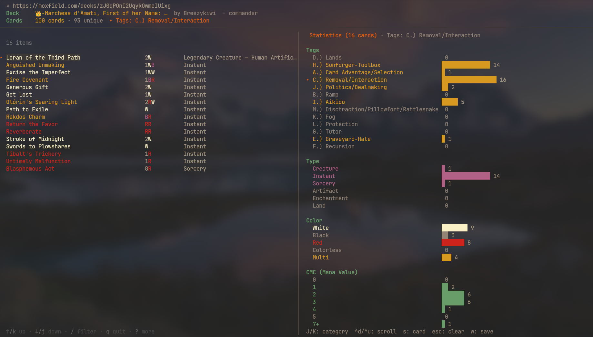

# scry

A terminal UI for looking up [Magic: The Gathering](https://magic.wizards.com/) cards, rules and wording history, built for Commander/EDH players who live in the terminal.

Card search comes from the [Scryfall API](https://scryfall.com/docs/api), the rules and glossary from the official [comprehensive rules](https://magic.wizards.com/en/rules), and the printed text of older printings from [MTGJSON](https://mtgjson.com/). *Scry* is a keyword action in its own right — rule 701.22, "look at the top card of your library" — which is roughly what this does.


## Features

- **Full Scryfall syntax** — search with the same query language you use on scryfall.com
- **Filtering** — narrow a list to the cards whose name or rules text actually contain what you typed
- **One screen** — search bar, result list and card panel together; no separate search page to pass through
- **Live preview** — card details shown alongside the list as you browse
- **Responsive layout** — horizontal split on wide terminals, vertical on narrow (tiling WM friendly)
- **Color-coded mana symbols** — WUBRG rendered in appropriate colors
- **Card details** — oracle text, P/T, legalities, rulings, EDHREC rank, all in one panel
- **Rulings as you browse** — Scryfall rulings load for whichever card is under the cursor, debounced so scrolling past a card costs nothing
- **Oracle text highlighting** — mana and tap symbols, keyword abilities, keyword actions, ability words, reminder text, loyalty costs and P/T modifiers, all coloured
- **Printed text history** — press `t` to see how a card's wording changed across its printings, from Alpha to today (via MTGJSON, since Scryfall only serves current oracle text)
- **Comprehensive rules built in** — press `r` to swap the card panel for the rules its text invokes, and browse the full rulebook and glossary (merged in from `mtg-rules`)
- **Statistics you can filter by** — `s` breaks the results down by colour, rarity, mana value and type; `J/K` walks those categories, narrows the list to whichever one you're on, and re-cuts every histogram for what's left
- **Configurable sort** — cycle sort orders; every search returns up to 175 cards
- **Moxfield decks** — paste a public deck URL (or `scry deck <id>`) to browse someone's list, with every card behaving like a search result
- **Decks of your own** — import a deck and keep it as a plain text file, one card per line, editable here or in your editor
- **Version history** — the decks directory is a git repository, so every change is a commit; browse the versions with `,g` and restore any of them
- **Deck tags in statistics** — card tags travel with the deck and get their own breakdown
- **Both faces of double-faced cards** — transforming and modal cards show each side's cost, type, P/T and rules text
- **Quick lookup mode** — pass a query that returns one card and get plain text output, no TUI
- **Built-in references** — `?` lists the keys for the screen you're on; `,s` is a Scryfall syntax guide focused on Commander
- **Gruvbox dark theme**

## Screenshots

A query that returns exactly one card prints straight to stdout — same highlighting, no TUI.



Search results with the card panel alongside — oracle text highlighted, rulings loaded for whichever card is under the cursor.



`r` swaps the panel for the comprehensive rules the card's text invokes — keyword abilities, keyword actions, ability words and the glossary entries behind them.


`enter` opens the full rules browser on the rules that card matched, with the rule text and its cross-references on the right.



`t` shows how the card's printed wording changed across its printings, one entry per distinct wording.



A public Moxfield deck opened by URL — the deck reads in decklist order, and its cards behave like any other result.



`s` breaks the list down by the author's tags, type, colour, mana value and rarity.



`J/K` walks those categories and narrows the cards to whichever one it's on — here the deck's removal, with the breakdown re-cut for just those sixteen cards. Categories the filter has emptied hold their places at zero, and the bars stay scaled to the whole deck.



## Install

### From source

Requires [Go 1.26+](https://go.dev/dl/) — that's what `go.mod` asks for.

```bash
git clone https://github.com/marbris/scry.git
cd scry
go build -o scry .
```

Then put it on your PATH however you prefer:

```bash
# Symlink (recommended — rebuilds are picked up automatically)
ln -s "$(pwd)/scry" ~/.local/bin/scry

# Or move it
mv scry ~/.local/bin/

# Or use go install
go install .
# (binary goes to ~/go/bin/)
```

### Arch Linux

```bash
sudo pacman -S go
git clone https://github.com/marbris/scry.git
cd scry
go build -o scry .
ln -s "$(pwd)/scry" ~/.local/bin/scry
```

Make sure `~/.local/bin` is in your `$PATH`.

### macOS

Download the latest binary from [Releases](https://github.com/marbris/scry/releases):

- Apple Silicon (M1/M2/M3): `scry-darwin-arm64`
- Intel Mac: `scry-darwin-amd64`

```bash
chmod +x scry-darwin-arm64
xattr -d com.apple.quarantine scry-darwin-arm64
mv scry-darwin-arm64 /usr/local/bin/scry
```

Or build from source:

```bash
brew install go
git clone https://github.com/marbris/scry.git
cd scry
go build -o scry .
mv scry /usr/local/bin/
```

### Windows

Download `scry-windows-amd64.exe` from [Releases](https://github.com/marbris/scry/releases) and add it to your PATH.

### Linux (other distros)

Download the latest binary from [Releases](https://github.com/marbris/scry/releases):

- x86_64: `scry-linux-amd64`
- ARM64: `scry-linux-arm64`

```bash
chmod +x scry-linux-amd64
mv scry-linux-amd64 ~/.local/bin/scry
```

## Usage

### Interactive mode

```bash
scry
```

Opens on the results screen with the search bar focused. Type a Scryfall query, hit enter, browse results. `i` or `esc` puts you back in the search bar.

### Direct query

```bash
scry "t:dragon c:R cmc<=5"
```

Runs the query straight away — the search bar shows it at the top while the results load.

### Quick lookup

If your query returns exactly one card, the details are printed to stdout without opening the TUI — with the same syntax highlighting the TUI uses, including the card's rulings:

```
$ scry ghen
Ghen, Arcanum Weaver  RWB
Legendary Creature — Human Wizard
P/T: 2/3
Commander Legends · rare · CMC 3
EDHREC Rank: #9208

Oracle Text
{R}{W}{B}, {T}, Sacrifice an enchantment: Return target enchantment card from
your graveyard to the battlefield.

Rulings (2)
  • Because targets are chosen before costs are paid (such as the cost of
    sacrificing an enchantment), Ghen's ability can't target the enchantment
    you intend to sacrifice to activate its ability.
  • An Aura put onto the battlefield this way doesn't target anything (so it
    could be attached to an opponent's permanent with hexproof, for example),
    but the Aura's enchant ability restricts what it can be attached to. If
    the Aura can't legally be attached to anything, it remains in your
    graveyard.

Legalities
  ✘ standard
  ✘ pioneer
  ✘ modern
  ✔ legacy
  ✔ vintage
  ✔ commander
  ✘ pauper
```

The text wraps to your terminal width, and the colour is dropped automatically when the output is piped or redirected.

### Moxfield decks

Any public [Moxfield](https://moxfield.com/) deck can be opened as a result list:

```bash
scry deck zJ0qPOnI2UqykOwmeIUixg            # the id out of the deck's URL
scry https://moxfield.com/decks/zJ0qPOnI2UqykOwmeIUixg
```

or paste the URL into the search bar instead of a query.

The deck reads in decklist order — commanders, then creatures, spells and lands, alphabetically within each — with repeat copies shown as `30x Mountain`. Everything the results view does works on a deck's cards: `r` for the rules a card invokes, `s` for the deck's curve and colour spread, `t` for printed text history, `/` to filter, `enter` to browse matched rules.

```
⌕ https://moxfield.com/decks/zJ0qPOnI2UqykOwmeIUixg
Deck     👑-Marchesa d'Amati, First of her Name: …  by Breezykiwi  · commander
  Cards    100 cards · 93 unique
──────────────────────────────────────────────────────────────────────────────────
Queen Marchesa         1RWB    Legendary Creature — Human Assassin
Brash Taunter          4R      Creature — Goblin                  
Breena, the Demagogue  1WB     Legendary Creature — Bird Warlock  
Flumph                 1W      Creature — Jellyfish               
Generous Plunderer     1R      Creature — Human Rogue             
...
```

Only the command zone and mainboard are loaded; sideboards and maybeboards are skipped. Moxfield stores a Scryfall id per card, so the deck request only supplies ids and quantities — the card data itself comes from Scryfall, which is why rulings, highlighting and rules matching all work unchanged. A 100-card deck is one Moxfield request plus two Scryfall lookups.

Private and unlisted decks aren't accessible; the deck has to be public.

#### Your own decks

Start an empty one, or copy in a deck you're browsing with `w`:

```bash
scry deck new "Ghen reanimator"
scry deck new "Winota aggro" modern     # commander unless you say otherwise
scry deck import https://moxfield.com/decks/zJ0qPOnI2UqykOwmeIUixg
scry deck marchesa-political      # open it
scry deck list                    # what you have
scry deck rm marchesa-political   # delete it
```

Your decks are files in `~/.local/share/scry/decks/`, one card per line, and they're meant to be read:

```
name: Marchesa, political
format: commander
source: https://moxfield.com/decks/zJ0qPOnI2UqykOwmeIUixg

[commander]
1 Queen Marchesa [wincon]

[mainboard]
1 Arcane Signet [ramp]
1 Anguished Unmaking [removal]
7 Plains
```

Edit them in the app or in your editor — both work, and neither surprises the other. Cards are named rather than pinned to a printing, so the file stays readable; add `(c21) 263` after a name if you want a particular one. `SCRY_DECKS_DIR` moves the directory somewhere you'd rather keep it.

#### Browsing someone's decks

`,m` lists a Moxfield user's decks — type their name or paste a link to their profile — with the format, size, colour identity and when each last changed. `enter` imports one, `b` browses it without importing, and decks you already have are marked. Only public decks are listed; Moxfield doesn't show anyone else's private or unlisted ones.

#### Editing

With one of your decks open, `a` adds the selected card and `x` takes it out — from either list, so a card you've just found in a search can go straight in, and one you spot in the search that you no longer want can come straight out. `+` and `-` change how many copies; `-` on the last one removes it. Adding a card that's already there won't quietly double it, since nearly every deck this is built for is singleton — `+` is how you ask for a second copy.

Edits are written a couple of seconds after you stop making them, so a burst of changes becomes one commit rather than twelve:

```
c57a6a5  +Dragonlord Ojutai, requantify Plains
0d7945a  Add Ghen
```

`u` undoes the last change, one step at a time — a bulk tagging counts as one step, so a single `u` puts all of it back. `w` writes immediately if you'd rather not wait, and quitting always writes first: an edit made a second before you quit is still an edit.

Two columns in front of every row say where a card stands. In the search results, `▪` marks the ones already in the open deck; in the deck, `★` marks a commander. `●` is a tagging mark. All three slots are always drawn, so rows never shift sideways underneath you.

`c` marks the selected card as a commander, and adds it first if it isn't in the deck yet — which is how a new deck starts: `scry deck new`, search for your commander, press `c`. Pressing `c` again unmarks it. scry doesn't know the rules and doesn't try to: how many commanders a deck has is between you and your playgroup, so several and none are both fine. It only records what you said, under a `[commander]` heading in the file.

A deck you're browsing off Moxfield is read-only; press `,i` to make it yours first.

#### History

That directory is a git repository, and every change scry makes to a deck is a commit:

```bash
scry deck log marchesa-political         # what changed, and when
scry deck restore marchesa-political 4de01ba
```

or press `,g` in the app to browse the versions with their diffs and restore one. Restoring writes a new commit rather than rewinding, so the version you restored over is still there. Changes you make in your own editor are committed too, the next time scry writes the deck — so they're never quietly overwritten.

Since it's an ordinary repository, `git log`, `git diff` and `git revert` all work on your decks:

```bash
git -C "$(scry deck dir)" log --patch marchesa-political.deck
```

Press `,d` to pick a deck without going back to the shell, or `,n` to start a new one.

Decks saved by a much older version of scry, which kept only a Moxfield address in `decks.json`, are no longer read. That file is left alone and `scry deck list` prints what's still in it, so you can import those decks and then delete it.

#### Tagging in bulk

Tags are your own labels on the cards in a deck — `ramp`, `removal`, `flying`, whatever you sort by. They live in the deck file, next to the card:

```
1 Anguished Unmaking [removal, instant]
```

The point of them is applying them to a lot of cards at once. Filter the deck down to what you mean, mark that lot, and tag them:

```
/flying    ⏎     narrow the list to what matches — name or oracle text
v                mark all three of them
T  flying  ⏎     tag them
```

Filtering is literal rather than fuzzy: `flying` matches the cards whose name or rules text contain that word, not every card whose letters happen to appear in that order. Terms are ANDed, and `"first strike"` in quotes is one term. `space` marks one card at a time and steps to the next, so a run of cards is one key held down. `V` clears the marks, and so does `esc`, before it touches anything else. A marked card stays marked while you filter, sort or edit around it — marks are held by card, not by row.

In the prompt, a leading `-` removes instead of adding, and commas separate several at once: `flying, evasion, -needs-review`. With nothing marked, `T` tags just the card under the cursor — never everything the filter is showing, which is what `v` is for.

The whole lot is one commit:

```
1222b50  retag Dragonlord Ojutai, retag Goldspan Dragon, retag Serra Angel
```

#### Card tags

Tags — your own, or the author's if the deck came from Moxfield — get their own breakdown in the statistics panel, counted by copies and commonest first:

```
Tags
  D.) Lands                     █████████████████████████████████████████ 38   
  H.) Sunforger-Toolbox         ████████████████████████████ 26                
  A.) Card Advantage/Selection  █████████████████ 16                           
  C.) Removal/Interaction       █████████████████ 16
```

Tags are per deck, so an untagged deck simply doesn't show the section.

### Statistics as a filter

`s` swaps the card panel for a breakdown of everything in the list — colour, rarity, mana value, type, and the author's tags if it's a tagged deck. The breakdown is a list in its own right: `J/K` walks it, and the cards narrow to whichever category the cursor is on.

```
───────────────────────────────────────────────────────────────────────────────────────────────────────────────────────────────────────────
                                                                        │   Statistics (16 cards) · Tags: C.) Removal/Interaction
16 items                                                                │
                                                                        │  Tags
Loran of the Third Path  2W          Legendary Creature — Human Artific…│    D.) Lands                                0
Anguished Unmaking       1WB         Instant                            │    H.) Sunforger-Toolbox                   ███████████████ 14
Excise the Imperfect     1WW         Instant                            │    A.) Card Advantage/Selection            █ 1
Fire Covenant            1BR         Instant                            │  ▸ C.) Removal/Interaction                 █████████████████ 16
```

The histograms redraw for whichever cards the selected category leaves on screen: land on **White** and every bar describes the white cards — their curve, their rarities, their types. Walking further re-cuts the same view again.

Categories the filter has emptied keep their places and read zero rather than disappearing, so nothing shifts under the cursor and you can always walk back out. Bars stay scaled to the unfiltered set, so a small category reads as small rather than refilling the panel. `ctrl+d` / `ctrl+u` scroll a long breakdown without moving the selected category; `esc` clears the filter, and the header shows which one is active until you do.

```
Statistics (30 cards) · Color: White      Statistics (12 cards) · Tags: Aura

Color                                     Type
▸ White       ██████████████████ 30         Creature      0
  Black       ██ 2                          Instant       0
  Red         █ 1                           Sorcery       0
  Colorless    0                            Artifact      0
  Multi       ██ 2                          Enchantment ██████████ 12
                                            Land          0
```

### Rules browser

```bash
scry rules              # browse the comprehensive rules and glossary
scry rules flying       # open pre-filtered
scry rules update       # re-download the latest rules text
```

The rules text is cached in `~/.local/share/scry/comprules.txt` and downloaded on first use.

### Example queries

```bash
# Gruul commanders
scry "id<=RG is:commander"

# Cheap removal in Commander
scry "otag:removal f:commander cmc<=3"

# Board wipes under 5 mana
scry "otag:boardwipe cmc<=5 f:commander"

# Partner commanders in Orzhov
scry "is:partner id<=WB"

# Red dragons sorted by EDHREC rank
scry "t:dragon c:R"
```

## Key Bindings

The scheme, in three rules:

- **A plain letter does something to what's in front of you** — add this card, remove it, swap the panel.
- **The leader, `,`, followed by one letter, goes somewhere else** — another screen, or something you do once a session rather than once a card. A hint bar lists the options, so nothing has to be remembered.
- **`q` leaves whatever you're on**, and leaves the app from the main screen. **`esc` peels one layer at a time** — marks, then the filter, then the statistics category, then the deck column — and quits when there's nothing left.

`?` shows the keys for the screen you're on. It's generated from the same table the app dispatches from, so it can't fall out of date.

### The leader

| Key | Action |
|---|---|
| `,d` | Decks — pick one to open |
| `,n` | New deck |
| `,g` | Deck history — browse versions and restore one |
| `,i` | Import the Moxfield deck you're browsing as one of your own |
| `,m` | Someone's decks on Moxfield — list them and import one |
| `,r` | Rules browser |
| `,s` | Scryfall query syntax |
| `,k` | Keys (same as `?`) |

In the search bar a comma is a comma — card names have them — so the leader only opens there when nothing has been typed. That's the case that needs it: a fresh launch, where the search bar has focus and there's no list to press a letter in.

### Results

| Key | Action |
|---|---|
| `↑/↓` or `j/k` | Move through the list |
| `tab` / `shift+tab` | Between the search results and the deck |
| `/` | Filter by name + oracle text (literal, not fuzzy) |
| `i` | Edit the search query |
| `J/K` or `shift+↑/↓` | Scroll the panel; in statistics, walk the categories |
| `ctrl+d` / `ctrl+u` | Scroll the panel half a screen |
| `r` | Rules for this card (press again for the card view) |
| `s` | Statistics for the list (press again for the card view) |
| `t` | Printed text history (press again for the card view) |
| `enter` | Browse the rules this card's text matched |
| `esc` | Peel one layer; quit when there's nothing left |
| `q` | Quit |
| `?` | Keys for this screen |

### The deck

| Key | Action |
|---|---|
| `a` | Add the selected card |
| `x` | Remove it (from either list) |
| `c` | Mark it a commander, or unmark it |
| `+` / `-` | Another copy, or one fewer |
| `u` | Undo the last change |
| `w` | Write the deck now |

### Tagging

| Key | Action |
|---|---|
| `space` | Mark this card, and step to the next |
| `v` / `V` | Mark everything the list is showing / clear the marks |
| `T` | Tag the marked cards — a leading `-` removes, commas separate |

### Search Bar

| Key | Action |
|---|---|
| `enter` | Run the search — or load the deck, if the text is a Moxfield URL |
| `tab` / `shift+tab` | Cycle sort order |
| `↑/↓` | Move through the results while typing |
| `esc` | Back to the results (quits if there are none) |

### Rules Browser

| Key | Action |
|---|---|
| `↑/↓` or `j/k` | Navigate rules |
| `/` | Search rules and glossary |
| `g` | Toggle rules / glossary |
| `J/K` | Scroll the rule text |
| `esc` or `q` | Back |

### Decks

| Key | Action |
|---|---|
| `↑/↓` or `j/k` | Move through your decks |
| `/` | Filter by name or format |
| `enter` | Open it |
| `n` | Start a new deck |
| `esc` or `q` | Back |

### Decks on Moxfield

| Key | Action |
|---|---|
| `↑/↓` or `j/k` | Move through their decks |
| `enter` or `i` | Import it as one of yours |
| `b` | Browse it without importing |
| `u` | Someone else's decks |
| `/` | Filter by name or format |
| `esc` or `q` | Back |

### Deck History

| Key | Action |
|---|---|
| `↑/↓` or `j/k` | Move through the versions |
| `J/K` | Scroll the diff |
| `/` | Search the history |
| `enter` | Restore this version (as a new commit — nothing is lost) |
| `esc` or `q` | Back |

### Global

| Key | Action |
|---|---|
| `ctrl+c` | Quit (writing any pending deck edit first) |

## Printed text history

Scryfall serves only a card's *current* oracle text — its `printed_text` field is populated for non-English cards only, and the API carries no oracle revision history. The wording as actually printed comes from [MTGJSON](https://mtgjson.com/)'s `originalText`, so `t` pulls from there.

MTGJSON publishes whole sets rather than single cards, so a heavily reprinted card means one file per set it appeared in. Nothing is downloaded until you press `t`, and the panel tells you how many sets it needs before fetching anything:

```
Text History · Serra Angel

45 printings across 45 sets.

28 sets aren't cached yet. MTGJSON only publishes whole sets, so
reading this card's old wording means downloading them.

t: download and show
```

Press `t` again to go ahead. Each set is distilled to a name → text map in `~/.local/share/scry/originals/` (a few KB each) and never fetched twice — 60 sets comes to about 1.5 MB on disk. The result lists one entry per *distinct wording*, not per printing:

```
Text History · Serra Angel
22 wordings · 45 printings

Limited Edition Alpha · 1993
Flying
Does not tap when attacking.

Revised Edition · 1994
Flying
Attacking does not cause Serra Angel to tap.

Seventh Edition · 2001
Flying
Attacking doesn't cause Serra Angel to tap.
```

## Configuration

There's nothing to configure — it works out of the box. Sorting defaults to EDHREC rank, and every search returns up to 175 cards.

`SCRY_DECKS_DIR` is the one exception: set it to keep your decks somewhere other than `~/.local/share/scry/decks/` — a directory you back up, or one already under version control, in which case scry uses that repository rather than making its own.

The layout adapts to the terminal width. The panel shows the card by default; `r` and `s` swap it for the rules or the statistics, and pressing the same key again brings the card back.

| Width | Layout |
|---|---|
| 160+ | search results │ deck │ panel — all three at once |
| 120–159 | one list │ panel, with `tab` swapping the deck in and out of the list |
| under 120 | stacked: list on top, panel underneath |

With a deck open, `tab` moves between the search results and the deck. The panel follows whichever has focus, so the card text, rules and statistics all describe the list you're working in — and each list keeps its own filter and its own statistics category.

## How It Works

The app uses the [Elm architecture](https://guide.elm-lang.org/architecture/) via Bubbletea:

```
User input → Update(msg) → new state → View() → render
                ↑                                    │
                └────────────────────────────────────┘
```

All card data comes from the [Scryfall REST API](https://scryfall.com/docs/api). No API key required. The app respects Scryfall's required headers and rate expectations — rulings are fetched only after the cursor has rested on a card for 100 ms, and each card's rulings are fetched at most once per session.

Keyword highlighting and the rules panel are driven by the official comprehensive rules rather than a hardcoded word list: keyword abilities come from rule 702's sub-headings, keyword actions from 701's, and ability words from the list inside rule 207.2c. A new set's keywords show up as soon as `scry rules update` pulls a newer rules file.

## Dependencies

- [bubbletea](https://github.com/charmbracelet/bubbletea) — TUI framework
- [bubbles](https://github.com/charmbracelet/bubbles) — text input, list components
- [lipgloss](https://github.com/charmbracelet/lipgloss) — terminal styling and layout
- [Scryfall API](https://scryfall.com/docs/api) — card data
- [Magic Comprehensive Rules](https://magic.wizards.com/en/rules) — rules text and glossary
- [MTGJSON](https://mtgjson.com/) — per-printing printed text
- [Moxfield](https://moxfield.com/) — public deck lists

## Acknowledgments

- [Scryfall](https://scryfall.com/) for their incredible free API
- [Charm](https://charm.sh/) for the Go TUI ecosystem
- [EDHREC](https://edhrec.com/) for Commander rankings
- [MTGJSON](https://mtgjson.com/) for the printed text of every printing
- The [Tagger](https://tagger.scryfall.com/) community for oracle tags

## License

MIT
