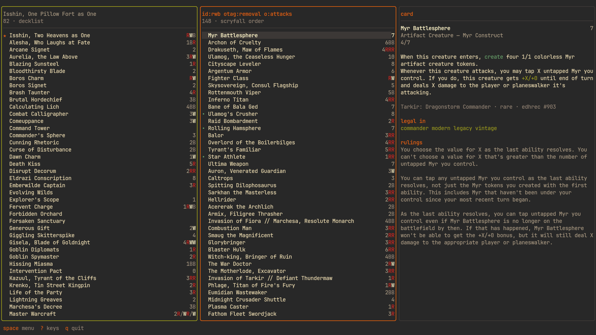
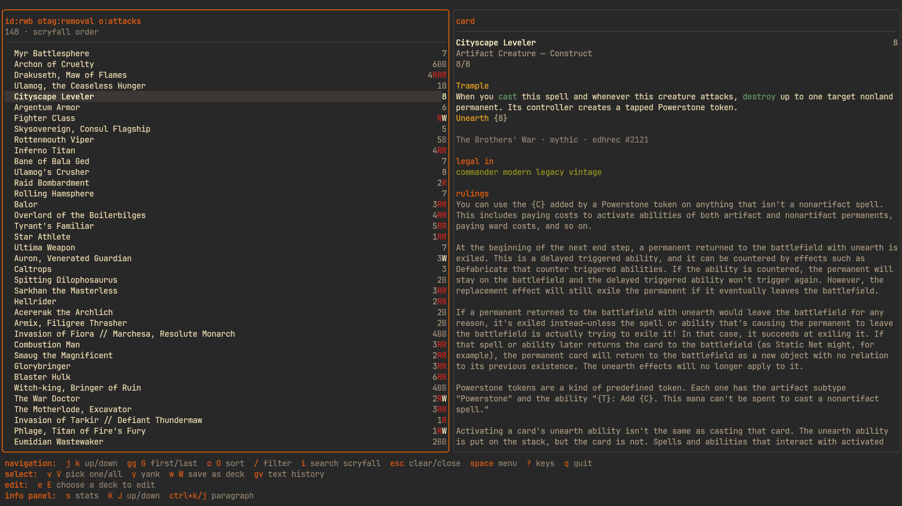
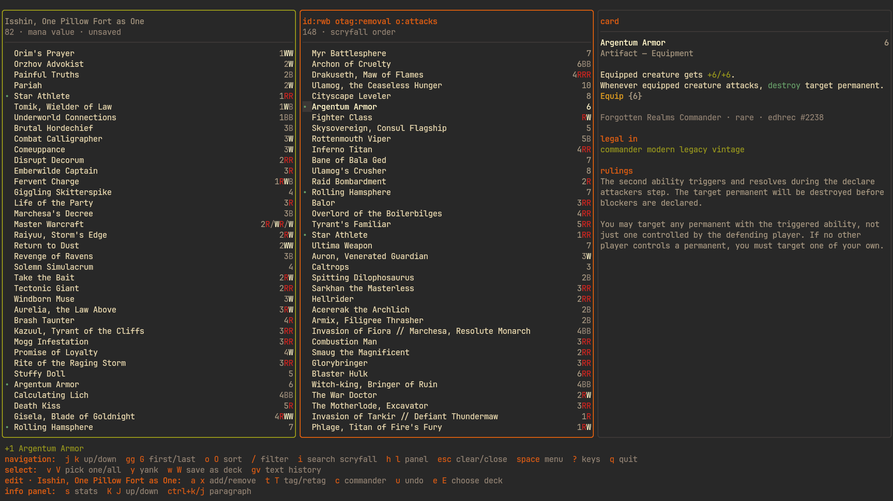
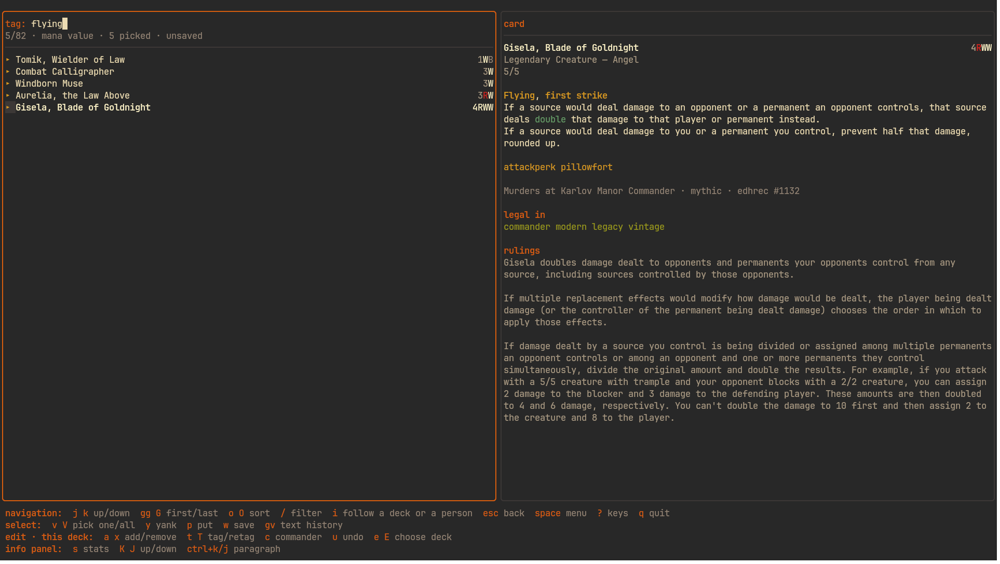
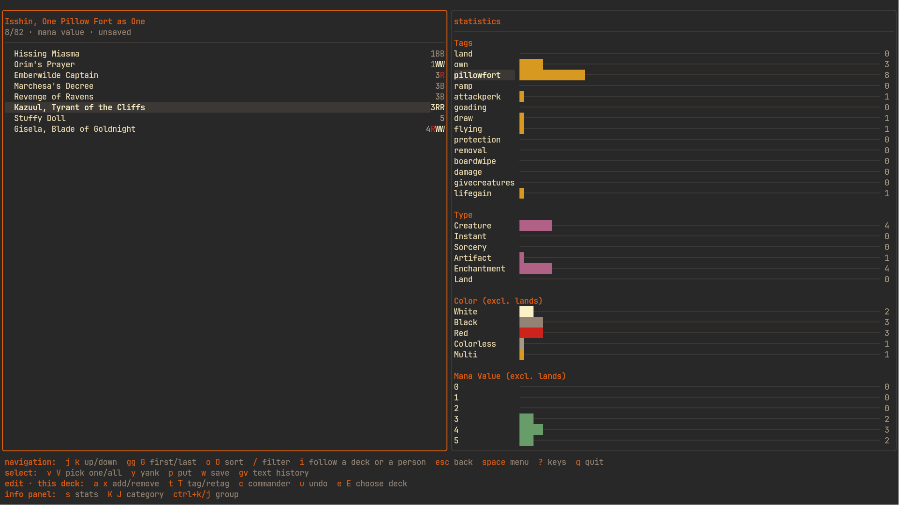
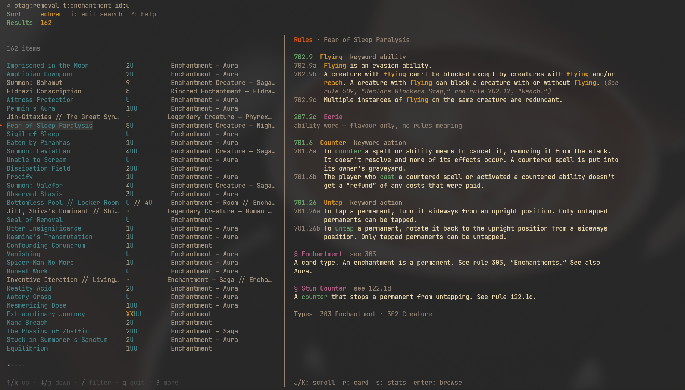
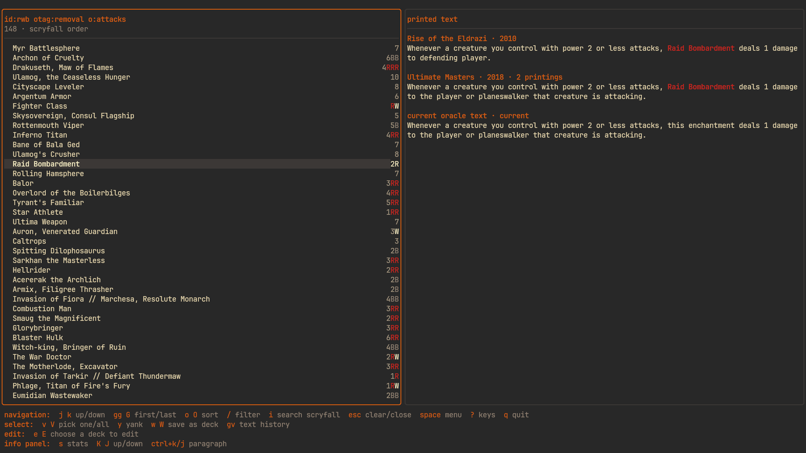
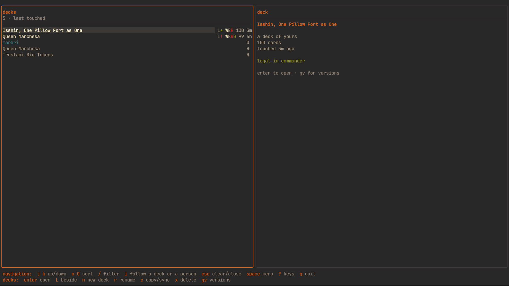
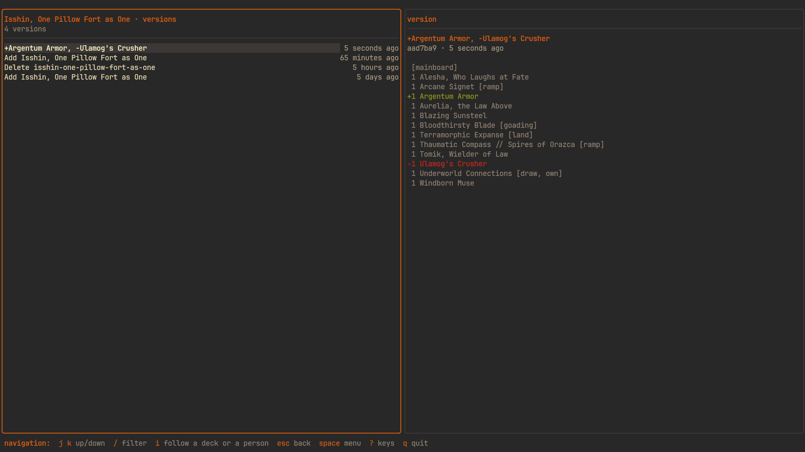
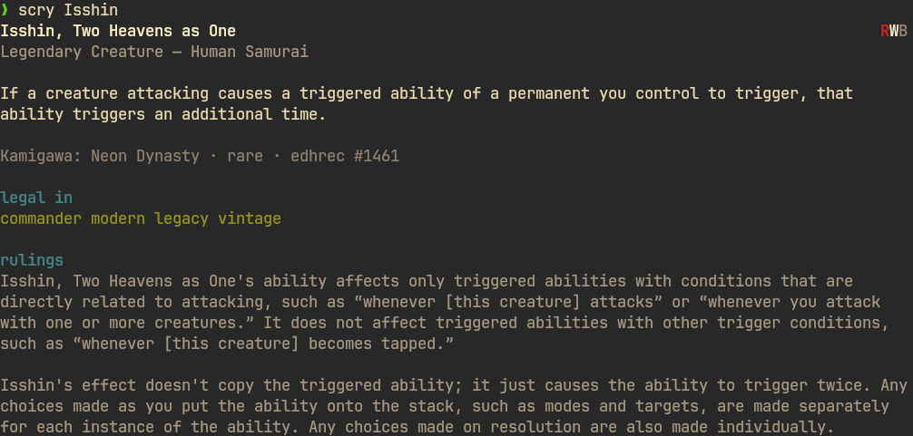

<div align="center">

# scry

**Build Magic: The Gathering decks from your terminal.**

A fast, keyboard-driven TUI that puts Scryfall search, your Moxfield decks, card rulings, and the comprehensive rules side by side — so you can go from "what removal is in these colours?" to a tagged, legal decklist without ever touching a mouse.




</div>

## What is this?

`scry` is a deck-building tool for Magic: The Gathering. It runs entirely in the terminal and is driven by the keyboard.

I search for cards on Scryfall and build decks on Moxfield, and juggling two web apps in two browser tabs had accumulated a pile of small frictions. `scry` is my attempt to file them all off at once: the search results and the decklist live in the same window, the rulings sit right next to the card, and adding a card to a deck is a single keystroke.

## Why not just use Scryfall and Moxfield?

You still can — `scry` reads from both. It just fixes the parts of that workflow that used to slow me down:

- **Search and decklist, side by side.** Any number of panels in one window: several Scryfall searches, several decklists, the rules — all open at once, all keyboard-navigable.
- **Add cards with a keystroke.** Scroll a search, press `a`, and the card lands in the deck you're editing. `x` takes it back out.
- **Rulings where you're looking.** A card's oracle text, rulings, and legalities show in the panel beside the list — not buried below a wall of buttons.
- **Denser lists, no card art.** Rows instead of tiles, so you see more of the search at once.
- **Tag cards in bulk.** Select a whole theme with one key and tag them together — then filter and sort by those tags.
- **Statistics you can drill into.** Filter a list by tag or category and watch the histograms recompute for exactly that subset.
- **Version-controlled decks.** Every deck is a plain file in a git repository, so every change is kept and `git log` works on your decks like anything else.
- **Sync across machines.** Because that repository is ordinary git, `scry` can mirror your whole collection to a private remote you own — GitHub, Codeberg, GitLab, self-hosted — and pull it back anywhere else. Set it up once, then `s` in the decks panel keeps both ends in step.
- **Moxfield built in.** Follow a deck by URL, or browse someone's decks by username, and pull a copy in to edit.
- **A couple of extras I find handy:** the comprehensive rules are searchable and drive keyword highlighting in card text, and you can see how a card's wording has changed across printings.

What it **doesn't** do (yet):

- It can't save decks back to Moxfield — though you can mirror them to a private git remote of your own instead (see [Sync across machines](#every-change-kept)).
- A Scryfall search returns the first 175 results, not the entire set.

## A quick tour

### Rulings, right next to the card

Scroll a search and the panel on the right fills in with the highlighted card: oracle text with keywords picked out, every ruling, and its format legalities. No scrolling past buttons to find them.



### Search on the left, deck on the right

Open a search beside the deck you're building. Cards already in the deck are marked, so you can see your coverage as you scan. `a` adds the highlighted card, `x` removes a copy, `u` undoes.



### Tag a whole theme at once

Narrow a list with `/`, select what's left with `V`, and tag them together with `t`. `T` adds them to the deck and tags them in one stroke — sorting a search into a deck is dozens of these.



### Statistics that answer questions

Open the statistics panel and walk the breakdown — tags, types, colours, the curve. Highlighting a category filters the list to it, and the histograms recompute for that subset. Moxfield shows you stats; here you can interrogate them.



### The rules, searchable

Search the comprehensive rules and read the full paragraph in the info panel as you scroll. Open the rules while a card is highlighted and you get the rules that card actually invokes.



### How a card's text has changed

Press `gv` on a card to see its printed wording across every printing — the errata and templating changes, side by side.



### Your decks, and Moxfield's

The decks panel lists your local decks alongside the Moxfield decks and users you follow, with colour identity, card counts, legality, and age. Follow a deck by pasting its URL; browse a person's decks by typing their username.



### Every change, kept

Each deck is a file in a git repository, so `scry` keeps every version. Press `gv` on a deck to walk its history and read the diff for each change — what you added, what you cut, and when.



And because it's a git repository, it can sync. Point `scry` at a private remote you own — `scry sync remote <url>` — and `s` in the decks panel (or `scry sync`) mirrors your whole collection to it and pulls back whatever you changed on another machine. It's plain git, so any host works — GitHub, Codeberg, GitLab, or your own server — and there's nothing to install beyond the git you already have. A remote you seeded with a README merges in cleanly on the first sync; the one thing git can't decide for you — the same deck edited two places at once — surfaces as a conflict to resolve with git, never a silent overwrite. Make the repo **private**; your decks are yours.

## Install

`scry` is a single self-contained binary. Grab a prebuilt one, or build from source.

### Prebuilt binaries

Download the right file for your machine from the [latest release](https://github.com/marbris/scry/releases):

| Platform | File |
| --- | --- |
| Linux (x86-64) | `scry-linux-amd64` |
| Linux (ARM64) | `scry-linux-arm64` |
| macOS (Apple Silicon) | `scry-darwin-arm64` |
| macOS (Intel) | `scry-darwin-amd64` |
| Windows (x86-64) | `scry-windows-amd64.exe` |

**Linux**

```bash
chmod +x scry-linux-amd64
mv scry-linux-amd64 ~/.local/bin/scry   # make sure ~/.local/bin is on your PATH
```

**macOS**

```bash
chmod +x scry-darwin-arm64
xattr -d com.apple.quarantine scry-darwin-arm64   # clears the "unidentified developer" block
mv scry-darwin-arm64 /usr/local/bin/scry
```

**Windows**

Download `scry-windows-amd64.exe`, rename it to `scry.exe`, and put it somewhere on your `PATH`.

### From source

Requires [Go 1.26+](https://go.dev/dl/).

```bash
git clone https://github.com/marbris/scry.git
cd scry
go build -o scry .

# Then put it on your PATH — a symlink means rebuilds are picked up automatically:
ln -s "$(pwd)/scry" ~/.local/bin/scry
# ...or just move it:  mv scry /usr/local/bin/
```

To build binaries for every platform at once (they land in `dist/`):

```bash
make all
```

## First run

Just run it:

```bash
scry
```

You'll land on a splash screen. Everything is discoverable from three keys:

- **`space`** opens the menu of things you can do (create panels, close them, save).
- **`?`** grows the hint bar at the bottom to the full list of keys for wherever you are. `?` again shrinks it back.
- **`q`** quits.

Press `space` then `f` to open your first Scryfall search.

## How it works

The screen is a **row of panels** with an **information panel** pinned to the right. You can open as many panels as you like — searches, decklists, the rules — and move between them with `h`/`l` (or the arrow keys). The info panel always describes whatever is highlighted in the focused panel.

Open panels straight to what you want:

| Keys | Opens |
| --- | --- |
| `space f` | a **Scryfall search** |
| `space d` | your **decks** (and Moxfield) |
| `space r` | the **comprehensive rules** |
| `space n` | a blank panel — `tab` cycles the search target |

**The editing deck.** One local deck is marked as the one you're editing — it carries a distinct border colour. The card-moving keys (`a` add, `x` remove, `t`/`T` tag, `c` commander) always act on *that* deck, from whatever panel you're in, so you can add to it from a search two panels over. With one deck open it's chosen automatically; `e`/`E` pick another; `gd` jumps to it.

**Building a deck, start to finish:**

1. `space d` → `n` to make a new deck (or open an existing one). It becomes the editing deck.
2. `space f` and run a Scryfall query.
3. Scroll the results; the info panel shows each card. Press `a` to add the highlighted card, or select several with `v`/`V` and add them together.
4. `/` filters what's on screen, `o`/`O` re-sorts it (mana value, type, colour, power/toughness, EDHREC rank…), `t` tags the selection.
5. `s` opens statistics for the list; walk the categories to filter and see the curve.
6. `w` saves the deck (and commits it to git). `space w` saves the editing deck from anywhere.

## Command line

`scry` is useful without opening the interface at all:

```bash
scry                                  # come back to the panels you left
scry 't:creature c:rw cmc<=3'         # run a Scryfall query
scry Isshin                           # one exact match prints straight to the terminal
scry https://moxfield.com/decks/...   # open a deck on Moxfield
```



Queries use [Scryfall's own syntax](https://scryfall.com/docs/syntax), so anything that works on the website works here.

There are a few subcommands, each with its own `-h`:

```bash
scry deck list                  # your decks
scry deck new <name> [format]   # start an empty deck
scry deck import <id|url> [as]  # copy a Moxfield deck in so you can edit it
scry deck log <name>            # what you've changed, and when (it's git)
scry deck restore <name> <ref>  # bring back an earlier version
scry deck dir                   # where your decks live on disk

scry sync                       # push and pull your decks
scry sync remote <url>          # connect a private git remote you own
scry sync status                # what's ahead or behind
scry sync off                   # disconnect (your decks are untouched)

scry rules <query>              # search the comprehensive rules
scry theme                      # list colour themes
scry theme <name>               # switch theme
```

Because every deck is a file in a git repository, `git log`, `git diff`, and friends work on your decks directly.

## Key bindings

The bottom of the screen always shows the keys for where you are — press `?` to expand it. The essentials:

<details>
<summary><b>Full key reference</b></summary>

**Getting around**

| Key | Does |
| --- | --- |
| `h` `l` / `←` `→` | previous / next panel |
| `ctrl+h` `ctrl+l` | move the focused panel along the row |
| `j` `k` | up / down in the list |
| `gg` `G` | first / last row |
| `K` `J` | move within the info panel |
| `ctrl+k` `ctrl+j` | info panel, a paragraph at a time |
| `space` | the menu · `?` grow the hint bar · `q` quit |

**In a list of cards**

| Key | Does |
| --- | --- |
| `/` | filter as you type |
| `o` `O` | cycle the sort order |
| `i` | edit the search |
| `v` `V` | select one / all shown |
| `a` `A` | add a copy to the editing deck · add-and-tag with the last tag |
| `t` `x` | tag the selection · remove a copy |
| `c` | set as the editing deck's commander |
| `u` | undo the last edit |
| `y` `p` | yank the selection · put it into this list |
| `s` | statistics for this list |
| `gv` | how this card's printed text has changed |
| `w` `W` | save this list as a deck (here / in a new panel) |

**In the decks panel**

The panel is a folder tree: local decks group by the folder part of their slug
(`aggro/mono-red`), and the Moxfield decks and people you follow sit under one
`moxfield` folder.

| Key | Does |
| --- | --- |
| `enter` | fold/unfold a folder, or open the deck/person |
| `L` | open beside, in a new panel |
| `i` | follow a Moxfield deck URL or a username |
| `n` `r` `c` | new (in the current folder) · rename · copy |
| `y` `x` `p` | yank (copy) · cut (move) · put into the folder you're on |
| `d` | delete |
| `s` | sync your decks to their git remote |
| `gv` | git versions of the deck |

**The editing deck**

| Key | Does |
| --- | --- |
| `e` `E` | choose which deck to edit |
| `gd` | jump to the editing deck |
| `space w` | save the editing deck from anywhere |

**Panels**

| Key | Does |
| --- | --- |
| `space f` `space d` `space r` | new search / decks / rules panel |
| `space n` | new blank panel (`tab` picks its target) |
| `space s` | statistics across every visible list |
| `space c` `space o` | close this panel / close the others |
| `space h` `space l` | move this panel left / right |

</details>

## Where your files live, and how to uninstall

`scry` follows the standard per-user directories for your OS. Four kinds of file live in four places, which is what tells a backup what to keep and an uninstall what's safe to delete:

| | Holds | Linux | macOS | Windows |
| --- | --- | --- | --- | --- |
| **Data** | your decks (back this up!) | `~/.local/share/scry` | `~/Library/Application Support/scry` | `%AppData%\scry` |
| **Config** | settings and themes | `~/.config/scry` | `~/Library/Application Support/scry` | `%AppData%\scry` |
| **State** | session, query history | `~/.local/state/scry` | `~/Library/Application Support/scry` | `%AppData%\scry` |
| **Cache** | downloaded card data, rules | `~/.cache/scry` | `~/Library/Caches/scry` | `%LocalAppData%\scry` |

`scry deck dir` prints your decks directory. Set `SCRY_DECKS_DIR` to keep them somewhere else.

**To uninstall:** delete the binary, then remove the directories above. On Linux:

```bash
rm ~/.local/bin/scry                       # the binary (wherever you put it)
rm -rf ~/.local/share/scry ~/.config/scry ~/.local/state/scry ~/.cache/scry
```

⚠️ The **data** directory is your decks. Copy it somewhere first if you want to keep them.

## Credits and sources

`scry` is a client for other people's excellent, freely available data. It wouldn't exist without:

- **[Scryfall](https://scryfall.com/)** — card data and the search syntax, via their [free API](https://scryfall.com/docs/api).
- **[Moxfield](https://moxfield.com/)** — public decklists and user decks.
- **[MTGJSON](https://mtgjson.com/)** — the printed text of every printing, for the wording history.
- **Wizards of the Coast** — the [comprehensive rules](https://magic.wizards.com/en/rules), which power the rules browser and the keyword highlighting.
- **[EDHREC](https://edhrec.com/)** — Commander play-rate rankings (the default search order).
- **The [Scryfall Tagger](https://tagger.scryfall.com/) community** — the oracle tags behind `otag:` searches.

Built with the **[Charm](https://charm.sh/)** stack — [Bubble Tea](https://github.com/charmbracelet/bubbletea), [Bubbles](https://github.com/charmbracelet/bubbles), and [Lip Gloss](https://github.com/charmbracelet/lipgloss).

## License

MIT — see [LICENSE](LICENSE).

---

*Magic: The Gathering is © Wizards of the Coast. `scry` is an unofficial fan-made tool, not produced by, endorsed by, or affiliated with Wizards of the Coast. All card names, rules text, and related content are property of their respective owners.*
